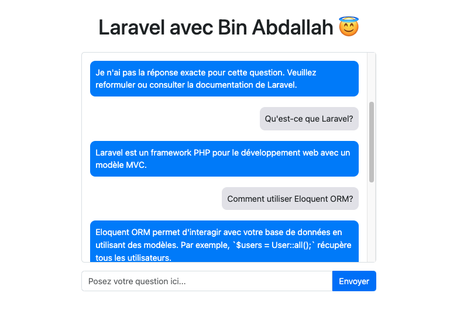
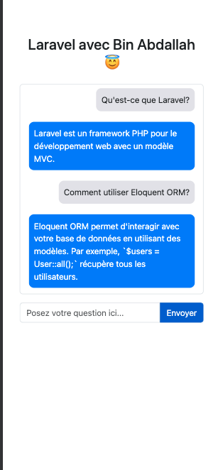

# Laravel Chatbot

Ce projet est une application chatbot simple construite avec Laravel et une interface utilisateur en HTML/CSS utilisant Bootstrap. Le chatbot permet aux utilisateurs de poser des questions et d'obtenir des réponses préenregistrées à partir d'une base de données.

## Fonctionnalités
- Répond à des questions basées sur des correspondances exactes ou partielles.
- Interface utilisateur intuitive pour discuter avec le chatbot.
- Gestion des erreurs pour les cas où aucune réponse n'est trouvée.

## Prérequis
Assurez-vous d'avoir les éléments suivants installés sur votre machine :
- PHP 8.0 ou version supérieure
- Composer
- Laravel Framework
- Une base de données compatible (MySQL, SQLite, etc.)

## Installation

1. Clonez ce dépôt :
```bash
git clone https://github.com/BounAbdallah/chatbot_1.git
cd chatbot_1
```

2. Installez les dépendances PHP :
```bash
composer install
```

3. Configurez votre fichier `.env` :
   - Copiez le fichier `.env.example` :
     ```bash
     cp .env.example .env
     ```
   - Mettez à jour les informations de connexion à la base de données.

4. Générez une clé d'application Laravel :
```bash
php artisan key:generate
```

5. Créez la table pour les questions et réponses :
   - Ajoutez une migration si elle n'est pas préexistante :
     ```php
     Schema::create('questions', function (Blueprint $table) {
         $table->id();
         $table->string('question');
         $table->text('answer');
         $table->timestamps();
     });
     ```
   - Appliquez la migration :
     ```bash
     php artisan migrate
     ```

6. Lancez le serveur de développement :
```bash
php artisan serve
```

7. Accédez à l'application dans votre navigateur :
   ```
http://127.0.0.1:8000/chatbot
   ```

## Utilisation
- Tapez une question dans le champ de saisie.
- Le chatbot recherchera une correspondance exacte ou partielle et répondra avec une réponse préenregistrée.
- Si aucune réponse n'est trouvée, une réponse par défaut sera retournée.

## Structure du Code
### Backend
- **Controller** : `ChatbotController`
  - Gère la logique principale pour traiter les questions et rechercher des réponses.
  - Deux méthodes de recherche :
    1. `findExactMatch` : Recherche une correspondance exacte dans la base de données.
    2. `findPartialMatch` : Recherche une correspondance partielle basée sur la similarité de texte.

### Frontend
- **HTML/CSS** :
  - Une interface utilisateur simple avec Bootstrap.
  - La communication entre le frontend et le backend est gérée via JavaScript et Fetch API.

## Démonstration
Voici les captures d'écran de l'application en action :






## Contribution
Les contributions sont les bienvenues ! Veuillez suivre les étapes suivantes :
1. Fork ce dépôt.
2. Créez une nouvelle branche :
   ```bash
   git checkout -b feature/nouvelle-fonctionnalite
   ```
3. Faites vos modifications et créez un commit :
   ```bash
   git commit -m "Ajout d'une nouvelle fonctionnalité"
   ```
4. Poussez les modifications :
   ```bash
   git push origin feature/nouvelle-fonctionnalite
   ```
5. Ouvrez une Pull Request.

## Licence
Ce projet est sous licence MIT. Consultez le fichier [LICENSE](LICENSE) pour plus de détails.

